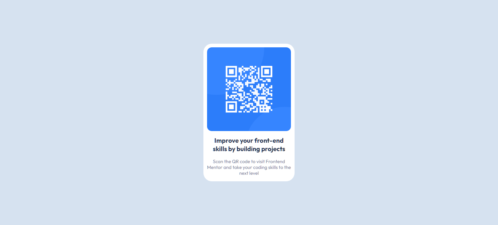

# Frontend Mentor - QR Code Component Solution

This is a solution to the [QR code component challenge on Frontend Mentor](https://www.frontendmentor.io/challenges/qr-code-component-iux_sIO_H). Frontend Mentor challenges help you improve your coding skills by building realistic projects.

## Table of Contents

- [Overview](#overview)
  - [Screenshot](#screenshot)
  - [Links](#links)
- [Built With](#built-with)
- [What I Learned](#what-i-learned)
- [Continued Development](#continued-development)
- [Useful Resources](#useful-resources)
- [Author](#author)
- [Acknowledgments](#acknowledgments)

## Overview

This project is a solution to the [QR code component challenge](https://www.frontendmentor.io/challenges/qr-code-component-iux_sIO_H) on Frontend Mentor. The challenge aims to enhance front-end coding skills by building a realistic QR code component.

### Screenshot



### Links

- [Solution URL](https://github.com/sliyarli/qr-code-component-solution)
- [Live Site URL](https://sliyarli.github.io/qr-code-component-solution/)

## Built With

- Semantic HTML5 markup
- CSS custom properties
- Flexbox
- Responsive design

## What I Learned

During the process of working on this project, I learned several valuable lessons and techniques:

- Implementing responsive design using Flexbox and CSS Grid.
- Creating a visually appealing and functional QR code component.
- Applying Google Fonts to enhance typography.
- Utilizing media queries for responsive layouts on various screen sizes.

```html
<h1>Some HTML code I'm proud of</h1>

<div id="qr-code-container">
  <div id="qr-code">
    <!-- QR Code Image -->
    

    <!-- QR Code Heading -->
    <h3 id="qr-heading">Improve your front-end skills by building projects</h3>

    <!-- QR Code Text -->
    <p id="qr-text">
      Scan the QR code to visit Frontend Mentor and take your coding skills to
      the next level
    </p>
  </div>
</div>
```

## Continued Development

In future projects, I plan to further focus on the following areas:

Enhancing accessibility and ensuring compatibility with various browsers.
Exploring advanced CSS techniques to create more intricate designs.
Improving my workflow and organization for efficient development.

## Useful Resources

CSS-Tricks - A great resource for CSS-related tips and tricks.
MDN Web Docs - An invaluable reference for web development documentation.

## Author

Frontend Mentor - @sliyarli

## Acknowledgments

I'd like to acknowledge the supportive community of Frontend Mentor and the valuable feedback from peers that helped me improve my coding skills and complete this project successfully.
